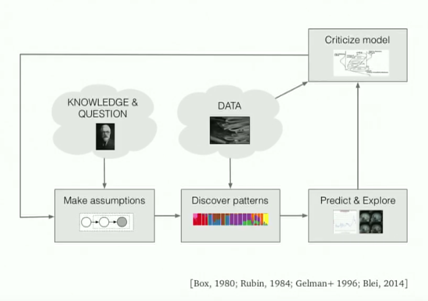
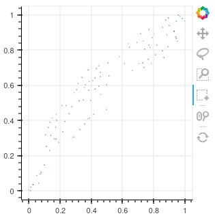
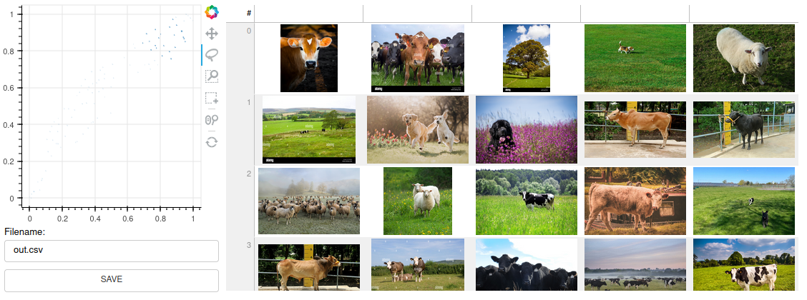
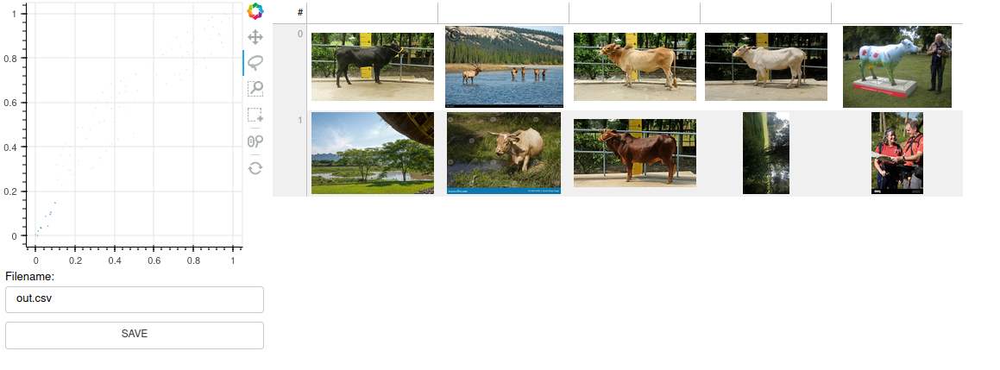
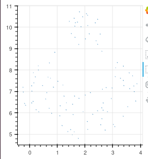
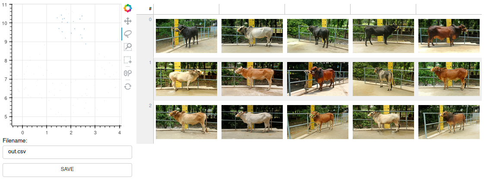
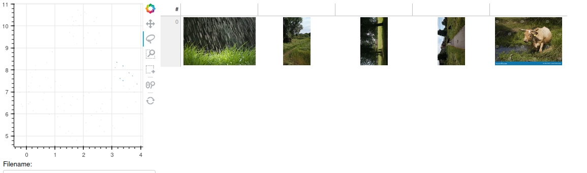

# T-SNE for Posterior Analysis of Deep Learning Models

Vincent Warmerdam proposes a T-SNE approach to the problem of [bulk labelling](https://github.com/koaning/bulk?tab=readme-ov-file).

Here we extend this tooling to other parts of the ML work flow.

## Background


**"What does the model I developed based on my assumptions say about the data that I care about?"**

[David Blei](https://www.youtube.com/watch?v=DaqNNLidswA) describes an iterative workflow that he calls **Box's Loop**:



1. Make assumptions about the world
2. Discover patterns based on data and the assumptions
3. Use the discovered patterns to form predictions
4. Look critically at what happened
5. Use the learning and criticism phase to revise assumptions

## Problem Statement

Deep Learning models are often seen as a black box. 
This presents difficulties of relating the models to the training data that they were trained on.
Rather than a linear 'train and forget' ML pipeline, an iterative process is required. Tools should support continuous improvement of the models. The inherent opacity of Deep Learning models
should be minimised by relating the model to the data it was trained on. 

## Baseline

We will use a simple Computer Vision binary classification; adimena's [cows-vs-no-cows](https://github.com/adimena/Cows-vs-no-cows). 
The data comes from a mixture of sources. Due to the nature of the training data there was no labelling step needed prior to training the binary classification model.

`Bulk` will not be used labelling for this task. The baseline step is purely about integrating the `adimena` data with the `Bulk` tool in the simplest way conceivable to test technology and understanding.  

### 1. Data Preparation 

Take a random reduced (100 images) sample set across the entire dataset.

```
$ mkdir smpl_set && cp `ls | shuf -n 100` smpl_set`
```

### 2. Create the Input File

Create the `ready.csv` input file with the [embetter](https://github.com/koaning/embetter) embeddings as shown in the [example](https://github.com/koaning/bulk?tab=readme-ov-file#bulk-image)

### 3. Run

The Bulk tool takes the created `ready.csv` as input

```
$ python -m bulk image ready.csv
```

----



The effect of using `embetter` to create the embeddings is apparent as the T-SNE plot has no evident clustering.

----

Taking a lasso of the top right:



----

And the bottom left:



----

We can see some visual differences between the two groups but it is not compelling. 
The technology and results work as expected at this point, but we need to take this further to achieve tooling that assists with the Box Cycle.

## Trained Model Embeddings

Koaning's ReadMe suggests we are free to use whatever embeddings we like.
We are interested in the relationship between the trained model and the original data.
For this we need to have the emdeddings from the trained model.
The next steps show how we can alter the workflow to improve our insight into the model. 

### 1. Create Embeddings

Create embeddings from adimena's model.

```python
"""                                                                                                                                                           
Create embeddings from an existing CNN model and it's training data.                                                                                          
"""

import glob

import numpy as np
import pandas as pd
import keras
from keras.preprocessing import image
from keras.models import Sequential
import umap

# Load in adimena's training model:                                                                                                                           
training_model = keras.models.load_model('short_run.keras')

print(training_model.summary())

# There are three Dense layers - create a new model that drops these:                                                                                         

embeddings_model = Sequential()
for layer in training_model.layers[:-3]:
    embeddings_model.add(layer)

print(embeddings_model.summary())

# Iterate through the sample set to collect the images                                                                                                        

fnames = []
image_data = []
for fname in glob.glob("smpl_set/*.jpg"):
    fnames.append(fname)
    img = image.load_img(fname, target_size=(150,150))
    x = image.img_to_array(img)
    x = np.expand_dims(x, axis=0)
    image_data.append(x)

# Create the embeddings from the trained model

images = np.vstack(image_data)
embeddings_arr = embeddings_model.predict(images)
 
# Reduce the dimensionality                                                                                                                                  

reducer = umap.UMAP()
reduced_vectors = reducer.fit_transform(embeddings_arr)
 
# Create input csv file for Bulk                                                                                                                              
df = pd.DataFrame(reduced_vectors.tolist(), columns=['x', 'y'])
df['path'] = fnames
df = df[['path', 'x', 'y']]
df.to_csv('adimena_embeddings.csv', index=False)
```

The model used for training had the following architecture:

```
 Layer (type)                Output Shape              Param #
=================================================================
 conv2d (Conv2D)             (None, 148, 148, 32)      896

 max_pooling2d (MaxPooling2D  (None, 74, 74, 32)       0 
 )

 conv2d_1 (Conv2D)           (None, 72, 72, 64)        18496

 max_pooling2d_1 (MaxPooling  (None, 36, 36, 64)       0 
 2D)

 conv2d_2 (Conv2D)           (None, 34, 34, 128)       73856

 max_pooling2d_2 (MaxPooling  (None, 17, 17, 128)      0
 2D)

 flatten (Flatten)           (None, 36992)             0

 dense (Dense)               (None, 512)               18940416

 dense_1 (Dense)             (None, 128)               65664

 dense_2 (Dense)             (None, 1)                 129

=================================================================
```

The model used to create the embeddings from the sample set:

```
 Layer (type)                Output Shape              Param #
=================================================================
 conv2d (Conv2D)             (None, 148, 148, 32)      896

 max_pooling2d (MaxPooling2D  (None, 74, 74, 32)       0
 )

 conv2d_1 (Conv2D)           (None, 72, 72, 64)        18496

 max_pooling2d_1 (MaxPooling  (None, 36, 36, 64)       0 
 2D)

 conv2d_2 (Conv2D)           (None, 34, 34, 128)       73856

 max_pooling2d_2 (MaxPooling  (None, 17, 17, 128)      0 
 2D)

 flatten (Flatten)           (None, 36992)             0 

=================================================================
```

### 2. Run

Load the created embeddings into `Bulk`:

```
python -m bulk image adimena_embeddings.csv
```

----

The data points fill more of the surface than the embetter example and there is some clustering evident.



----

Taking a look at one of these clusters



This is encouraging, not only are the images visually similar they come from [the same dataset](https://www.kaggle.com/datasets/sadhliroomyprime/cattle-weight-detection-model-dataset-12k)!

----




Another cluster shows how there can be clusters of visually similar data that cut across the desired classifications.

----

## Conclusion

Tools that improve analysis of models and allow flexibile workflow integration are necessary to improve the methodologies when working with Deep Learning models.
With some small hacks koaning's tool takes some of the guess work over the scope for areas of improvement on a simple CNN binary classifier. Visualisation tooling on the trained emdbeddings seems to fit well with the Box Loop as it quickly allows the Researcher to test their assumptions about the model and the data.  
